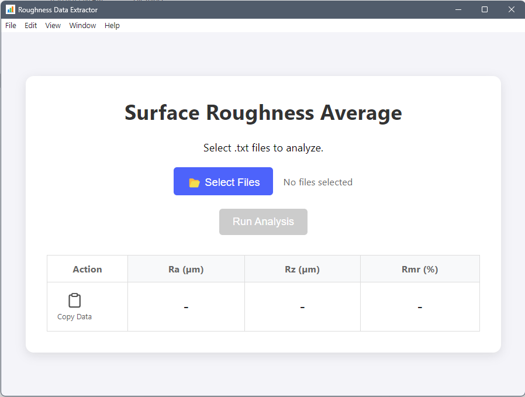

# 1019 Data Extractor

A hybrid desktop application for metrology and quality control. It bridges a modern Electron GUI with a Python data processing engine to automatically extract, filter, and average surface roughness metrics (Ra, Rz, Rmr) from raw instrument text files.

## 📸 Interface


## ✨ Features
* **🚀 Hybrid Architecture:** Combines the visual flexibility of Electron (HTML/JS) with the raw data processing power of Python.
* **📄 Intelligent Parsing:** Automatically identifies and extracts key metrics (Ra, Rz, Rmr) from unstructured instrument logs.
* **📊 Auto-Averaging:** Calculates statistical averages for batch readings instantly.
* **📋 One-Click Copy:** Formats processed data for immediate pasting into Excel or quality reports.

## 🛠️ Tech Stack
* **Frontend:** Electron, HTML5, CSS3, JavaScript (IPC Renderer)
* **Backend:** Python 3.x (Data Logic), PyInstaller (Binary Compilation)
* **Build System:** Electron Forge

## 🚀 Installation & Build
This project requires both Node.js and Python environments to build from source.

### 1. Prerequisites
```bash
# Install Node dependencies
npm install

# Install Python dependencies
pip install pyinstaller
```

### 2. Building the Python Engine
The Electron app relies on a compiled Python executable (`calc.exe`) to perform the math logic.
```bash
pyinstaller --noconfirm --onefile --noconsole --name "calc" --clean "calc.py"
# Move the resulting dist/calc.exe to the project root
mv dist/calc.exe ./
```

### 3. Running the App
```bash
# Start the application in development mode
npm start

# Package the application for distribution
npm run make
```

## 👤 Author
**Jason Sparks** - [GitHub Profile](https://github.com/webdev-jason)

## 📄 License
This project is licensed under the MIT License - see the [LICENSE](LICENSE) file for details.